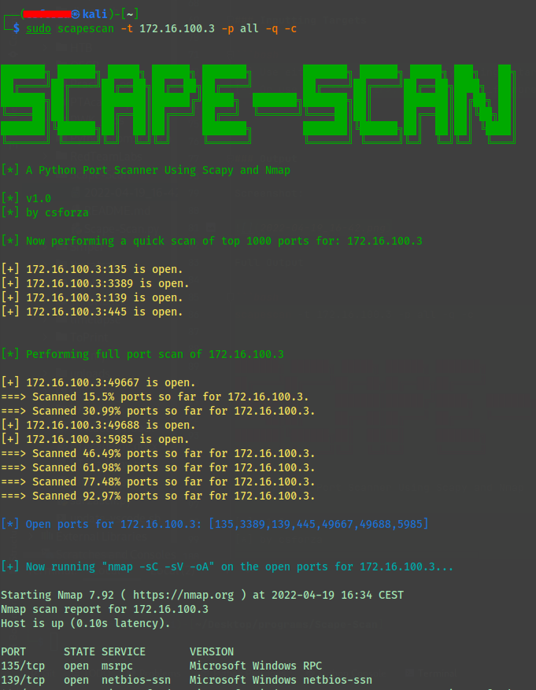

# Scape-Scan - A Python Port Scanner Using Scapy and Nmap

**Version 1.1 - Ping sweeping now available**

From what was a simple port scanner using Scapy, I decided to expand upon the program I created for a class.  It performs quick scanning
of any ports you wish, given an IP or set of IP's that you wish to scan.

You have the options to perform a quick port scan using only Scapy, a quick Nmap scan, or a 
more detailed Nmap scan using '-sC -sV -oA' in which the Nmap output is saved to your folder in all formats.

I also offer an option to run a 'confirm' Nmap -T4 scan in case you are not sure that the results
are not sufficient.

Finally, there is also an option to just scan the Nmap Top 1000 ports without having to input any ports.

I had designed this in preparation for the OSCP exam, in order that I can do some quick
enumeration while having the program do a more full scan in the background.

I have colorized the output for easier viewing and made the program print out a list
of all the open ports as well.

I intend to expand upon this in the future since I have now decided to publish this program.
At the very least I intend to add the option to add your own personal Nmap options, so that 
you can run whatever Nmap scan you wish after the quick enumeration scans.

Note: you may have to run this as sudo.

I tinkered with the timeout on line 186 and found a timeout of 0.4s to give the most optimal and
consistent results.  A lower timeout will miss an open port or two.  A higher timeout
sacrifices speed for more assured results.  


## USAGE

```bash
python Scape-Scan.py --help            


███████╗ ██████╗ █████╗ ██████╗ ███████╗        ███████╗ ██████╗ █████╗ ███╗   ██╗
██╔════╝██╔════╝██╔══██╗██╔══██╗██╔════╝        ██╔════╝██╔════╝██╔══██╗████╗  ██║
███████╗██║     ███████║██████╔╝█████╗  ███████╗███████╗██║     ███████║██╔██╗ ██║
╚════██║██║     ██╔══██║██╔═══╝ ██╔══╝  ╚══════╝╚════██║██║     ██╔══██║██║╚██╗██║
███████║╚██████╗██║  ██║██║     ███████╗        ███████║╚██████╗██║  ██║██║ ╚████║
╚══════╝ ╚═════╝╚═╝  ╚═╝╚═╝     ╚══════╝        ╚══════╝ ╚═════╝╚═╝  ╚═╝╚═╝  ╚═══╝

[*] A Python Port Scanner Using Scapy and Nmap

[*] v1.1 - Ping Sweeping Now Available 
[*] by csforza

usage: Scape-Scan.py [-h] [-t IP] [-p PORTS] [-q] [-c] [-P]

options:
  -h, --help            show this help message and exit
  -t IP, --target IP    Target ip(s) to scan
  -p PORTS, --ports PORTS
                        Port range to scan.
  -q, --top-1000        Quick top 1000 port scan.
  -c, --confirm-scan    Run an nmap scan on specified ports to confirm results
  -P, --ping            Perform a ping sweep.
```

### Inputting Ports

```bash
[-] Use either '-p <port> - <port>' to specify a range
[-] Use either '-p <port> - <port>, <port> - <port>' to specify more than one range
[-] Use '-p <port>' or '-p <port>,<port>....' to specify specific port(s)
[-] Use '-p all' to specify all ports
[-] Use '-q' or '--top-1000' to scan the nmap top 1000 ports
```

### Inputting Targets

```bash
[-] Use either '-t <IP>' to specify a single target
[-] Or use '-t <IP>, <IP>, ....' to specify more than one target
```

### Ping Sweeping

- Can use as a standalone option.
- Or if run with other parameters, then it will grab the open hosts and scan them with your specified parameters.

```bash
python Scape-Scan.py -t 10.10.110.123-125 -P -q                                                 


███████╗ ██████╗ █████╗ ██████╗ ███████╗        ███████╗ ██████╗ █████╗ ███╗   ██╗
██╔════╝██╔════╝██╔══██╗██╔══██╗██╔════╝        ██╔════╝██╔════╝██╔══██╗████╗  ██║
███████╗██║     ███████║██████╔╝█████╗  ███████╗███████╗██║     ███████║██╔██╗ ██║
╚════██║██║     ██╔══██║██╔═══╝ ██╔══╝  ╚══════╝╚════██║██║     ██╔══██║██║╚██╗██║
███████║╚██████╗██║  ██║██║     ███████╗        ███████║╚██████╗██║  ██║██║ ╚████║
╚══════╝ ╚═════╝╚═╝  ╚═╝╚═╝     ╚══════╝        ╚══════╝ ╚═════╝╚═╝  ╚═╝╚═╝  ╚═══╝

[*] A Python Port Scanner Using Scapy and Nmap

[*] v1.1 - Ping Sweeping Now Available 
[*] by csforza

[+] Host 10.10.110.123 is open.
[+] Host 10.10.110.124 is open.
[-] Host 10.10.110.125 is not open.

[*] Now performing a quick scan of top 1000 ports for: 10.10.110.123

[+] 10.10.110.123:22 is open.
[+] 10.10.110.123:80 is open.
[+] 10.10.110.123:8000 is open.
[+] 10.10.110.123:8089 is open.

[*] Open ports for 10.10.110.123: [22,80,8000,8089]

[*] Now performing a quick scan of top 1000 ports for: 10.10.110.124

[+] 10.10.110.124:80 is open.

[*] Open ports for 10.10.110.124: [80]

[+] Now running "nmap -sC -sV -oA" on the open ports for 10.10.110.123...

...
```

### Output

Screenshot:



Full Output:

```bash
scapescan -t 172.16.100.3 -p all -q -c                                                                                                                                                                                            2 ⨯


███████╗ ██████╗ █████╗ ██████╗ ███████╗        ███████╗ ██████╗ █████╗ ███╗   ██╗
██╔════╝██╔════╝██╔══██╗██╔══██╗██╔════╝        ██╔════╝██╔════╝██╔══██╗████╗  ██║
███████╗██║     ███████║██████╔╝█████╗  ███████╗███████╗██║     ███████║██╔██╗ ██║
╚════██║██║     ██╔══██║██╔═══╝ ██╔══╝  ╚══════╝╚════██║██║     ██╔══██║██║╚██╗██║
███████║╚██████╗██║  ██║██║     ███████╗        ███████║╚██████╗██║  ██║██║ ╚████║
╚══════╝ ╚═════╝╚═╝  ╚═╝╚═╝     ╚══════╝        ╚══════╝ ╚═════╝╚═╝  ╚═╝╚═╝  ╚═══╝

[*] A Python Port Scanner Using Scapy and Nmap

[*] v1.0 
[*] by csforza

[*] Now performing a quick scan of top 1000 ports for: 172.16.100.3

[+] 172.16.100.3:135 is open.
[+] 172.16.100.3:3389 is open.
[+] 172.16.100.3:139 is open.
[+] 172.16.100.3:445 is open.


[*] Performing full port scan of 172.16.100.3

[+] 172.16.100.3:49667 is open.
===> Scanned 15.5% ports so far for 172.16.100.3.
===> Scanned 30.99% ports so far for 172.16.100.3.
[+] 172.16.100.3:49688 is open.
[+] 172.16.100.3:5985 is open.
===> Scanned 46.49% ports so far for 172.16.100.3.
===> Scanned 61.98% ports so far for 172.16.100.3.
===> Scanned 77.48% ports so far for 172.16.100.3.
===> Scanned 92.97% ports so far for 172.16.100.3.

[*] Open ports for 172.16.100.3: [135,3389,139,445,49667,49688,5985]


[+] Now running "nmap -sC -sV -oA" on the open ports for 172.16.100.3...

Starting Nmap 7.92 ( https://nmap.org ) at 2022-04-19 16:34 CEST
Nmap scan report for 172.16.100.3
Host is up (0.10s latency).

PORT      STATE SERVICE       VERSION
135/tcp   open  msrpc         Microsoft Windows RPC
139/tcp   open  netbios-ssn   Microsoft Windows netbios-ssn
445/tcp   open  microsoft-ds  Microsoft Windows Server 2008 R2 - 2012 microsoft-ds
3389/tcp  open  ms-wbt-server Microsoft Terminal Services
| ssl-cert: Subject: commonName=biz1.bizcorp.local
| Not valid before: 2022-03-21T11:32:39
|_Not valid after:  2022-09-20T11:32:39
| rdp-ntlm-info: 
|   Target_Name: biz1
|   NetBIOS_Domain_Name: biz1
|   NetBIOS_Computer_Name: BIZ1
|   DNS_Domain_Name: bizcorp.local
|   DNS_Computer_Name: biz1.bizcorp.local
|   DNS_Tree_Name: bizcorp.local
|   Product_Version: 10.0.14393
|_  System_Time: 2022-04-19T14:35:26+00:00
|_ssl-date: 2022-04-19T14:36:06+00:00; +30s from scanner time.
5985/tcp  open  http          Microsoft HTTPAPI httpd 2.0 (SSDP/UPnP)
|_http-title: Not Found
|_http-server-header: Microsoft-HTTPAPI/2.0
49667/tcp open  msrpc         Microsoft Windows RPC
49688/tcp open  msrpc         Microsoft Windows RPC
Service Info: OSs: Windows, Windows Server 2008 R2 - 2012; CPE: cpe:/o:microsoft:windows

Host script results:
| smb2-time: 
|   date: 2022-04-19T14:35:28
|_  start_date: 2022-04-19T10:32:56
| smb2-security-mode: 
|   3.1.1: 
|_    Message signing enabled but not required
| smb-security-mode: 
|   authentication_level: user
|   challenge_response: supported
|_  message_signing: disabled (dangerous, but default)
|_clock-skew: mean: 29s, deviation: 0s, median: 29s

Service detection performed. Please report any incorrect results at https://nmap.org/submit/ .
Nmap done: 1 IP address (1 host up) scanned in 96.48 seconds

[+] Nmap scan on 172.16.100.3 is now finished. See 172.16.100.3.nmap for output.


[+] Now running a quick -T4 nmap scan on all ports on 172.16.100.3 to confirm results.

Starting Nmap 7.92 ( https://nmap.org ) at 2022-04-19 16:35 CEST
Nmap scan report for 172.16.100.3
Host is up (0.048s latency).
Not shown: 65528 filtered tcp ports (no-response)
PORT      STATE SERVICE
135/tcp   open  msrpc
139/tcp   open  netbios-ssn
445/tcp   open  microsoft-ds
3389/tcp  open  ms-wbt-server
5985/tcp  open  wsman
49667/tcp open  unknown
49688/tcp open  unknown

Nmap done: 1 IP address (1 host up) scanned in 91.59 seconds

Finished in 518.73 second(s).
```

